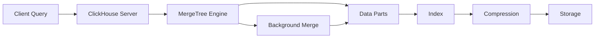

# Storage Engine Architecture

```mermaid
flowchart LR

A[Client Query]

A --> B[ClickHouse Server]

B --> C[MergeTree Engine]

C --> D[Data Parts]

D --> E[Index]

E --> F[Compression]

F --> G[Storage]

C --> H[Background Merge]

H --> D
```
